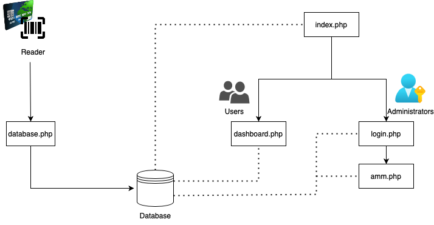
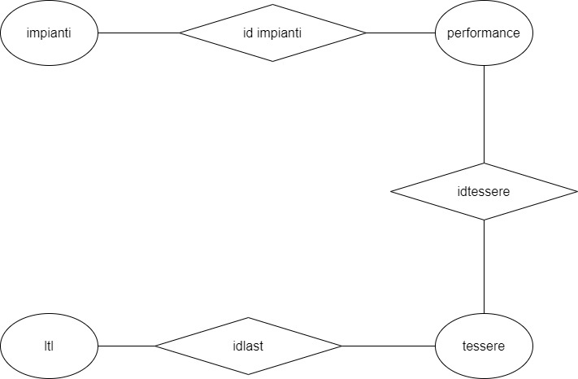

# Super Ski
The goal of this project is to design and program a system that simulates a ski area with NFC cards or tags as skipass. The overview of the season is accessible via web, and shows all the performances related to that skipass. 


[Project video](https://drive.google.com/file/d/1-N1KBqDRInrKE4cuiXDRr68DaXGG01-c/view?usp=sharing)

[Project Presentation](https://drive.google.com/file/d/1POJkp52c55bXDivYHN9JBoa7oEpq8Kii/view?usp=share_link)

# Components
## Hardware Components
- ESP-32;
- NFC Cards and Tags;
- Connection cables;
- PN532 NFC Reader;
## Software Components
- Arduino IDE to program ESP32 and NFC reader;
- XAMPP to start web server (phpMyAdmin, Apache web server)
- PHP to develop web pages;
- JS to code web pages (to get graphs);
- CSS to program the style of web pages;
# Setup
## Hardware Setup
- Connect the ESP board to the PC;
- Link NFC Reader to ESP32 board paying attenetion to order of pins;
## Software Setup
- Load the Arduino code on the board;
- Include libraries for the communication with NFC device and WiFi (WiFi.h, HTTPClient.h, PN532_HSU.h, PN532.h);
- Import web pages and database on server;
```bash
EMBEDDED_PROJECT
├── README.md
├── code
│   ├── arduino
│   │   ├── debug.cfg
│   │   ├── debug_custom.json
│   │   ├── esp32.svd
│   │   └── skipass.ino
│   └── web
│       ├── amm.php
│       ├── ammbis.php
│       ├── cover.css
│       ├── dashboard.css
│       ├── dashboard.js
│       ├── dashboard.php
│       ├── dashboard.rtl.css
│       ├── database.php
│       ├── index.php
│       ├── login.php
│       ├── mg.jpg
│       └── signin.css
├── diagramma.jpg
└── sistemaEmbedded.png

```


# Code Explanation

The system is designed to recognize different NFC cards by bringing them near the reader, memorize  date, time and lift on the databse and return an overall report of all the performances.
This overview is shown online by logging in with the card ID.



The entire project is composed by various parts:
- Arduino code:
  - Connect to WiFi;
  - Search for PN532 Module and it activate when found;
  - Wait for a card, get the number and send to web server;
- index.php:
  - First page displayed
  - The user can enter the card ID or place it on the reader;
  - If the card is valid, the user can access the performances related to that card.
  - Link to administer the system;
- dashboard.php:
  - The user select the date;
  - Overall of the performances of the selected day with tables and graphs and statistics;
- login.php:
  - Administration area login;
- amm.php:
  - An administrator can place a card on the reader;
  - Association/dissociation of cards.
- database.php:
  - Page not shown by the user;
  - Storage of the last card read;
# DataBase relations



# Team
Gabriele Fasoli - Nicola Turniano
